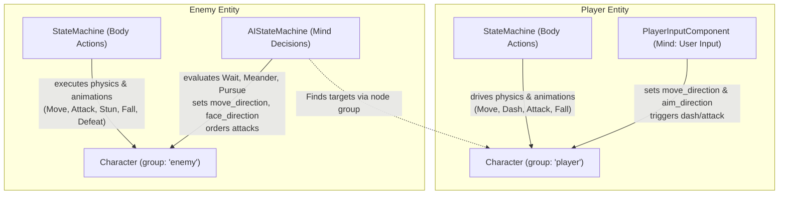

# Implementation Plan - Unify Character Architecture & Dual State Machines (Issue #2)

Unify `Player` and `Enemy` into a single `Character` class (`character.gd` extending `CharacterBody3D`), decouple controls into dedicated components (`PlayerInputComponent` for user input, `AIStateMachine` for enemy behavior), and establish a dual state machine architecture on enemies where the Mind orders the Body.

> [!NOTE]
> Per user directive: No backwards compatibility accessors will be maintained. All scenes, scripts, and tests will be refactored cleanly to use the new paradigm (`Character`, `mesh_mount`, `movement_speed`, `animation_tree`, `is_in_group("player")` / `is_in_group("enemy")`, etc.).

## Proposed Architecture Overview

---

## Refactoring Breakdown

### 1. Character Core Layer (`res://Character/character.gd`)
- Extends `CharacterBody3D`, `class_name Character`.
- Standardized properties (no redundant aliases):
  - `@export var movement_speed: float = 8.0`
  - `@export var decay: float = 12.0`
  - `@export var damage_stat: float = 100.0`
  - `@export var mesh_mount: Node3D`
  - `@export var health_component: HealthComponent`
  - `@export var knockback_component: KnockbackComponent`
  - `@export var animation_tree: AnimationTree`
  - `@export var state_machine: StateMachine`
  - `@export var ai_state_machine: AIStateMachine`
  - `@export var navigation_agent_3d: NavigationAgent3D`
  - `@export var weapon_hitbox: Area3D`
- Control intents:
  - `var move_direction: Vector3 = Vector3.ZERO`
  - `var aim_direction: Vector3 = Vector3.ZERO`
  - `var face_direction: Vector3 = Vector3.ZERO`
- Signals & methods:
  - `signal defeat`
  - `signal health_changed(value: float)`
  - `look_toward_direction(direction: Vector3, delta: float) -> void`
  - `look_at_target(target: Vector3) -> void`
  - `get_damage_modifier() -> float`
  - `get_opposing_group() -> String`
  - `get_nearest_target(group_name: String = "") -> Character`
  - `reset_game_state() -> void`
- Remove `Player/player.gd`, `Enemy/enemy.gd`, `Enemy/ranged_enemy.gd`.

### 2. Player Input Component (`res://Components/player_input_component.gd`)
- Extends `Node`, `class_name PlayerInputComponent`.
- Exports:
  - `@export var character: Character`
  - `@export var dash_cooldown: Timer`
  - `@export var dash_audio: AudioStreamPlayer3D`
  - `@export var damage_tint: ColorRect`
- Handles input polling and action triggers (dash, attack).

### 3. State Machine & States
- `CharacterState` (`res://StateMachine/character_state.gd`):
  - Extends `State`, `class_name CharacterState`.
  - `@export var character: Character`
  - `@export var fall_state: CharacterState`
  - Unified `core_movement(delta: float, speed: float, direction: Vector3) -> void`
- Update `player_state.gd` and `enemy_state.gd` to extend `CharacterState` or replace with direct `CharacterState` subclasses:
  - `player_run.gd`, `player_attack.gd`, `player_dash.gd`, `player_fall.gd`
  - `enemy_move.gd`, `enemy_attack.gd`, `enemy_stun.gd`, `enemy_defeat.gd`, `enemy_fall.gd`

### 4. AI State Machine Layer (The Mind)
- `AIStateMachine` (`res://StateMachine/ai_state_machine.gd`): extends `StateMachine`, `class_name AIStateMachine`.
- `AIState` (`res://StateMachine/ai_state.gd`): extends `State`, `class_name AIState`.
- `AIWait` (`res://StateMachine/AIStates/ai_wait.gd`)
- `AIMeander` (`res://StateMachine/AIStates/ai_meander.gd`)
- `AIPursue` (`res://StateMachine/AIStates/ai_pursue.gd`)

### 5. Projectile Spawner Component
- `ProjectileSpawnerComponent` (`res://Components/projectile_spawner_component.gd`) to handle ranged attacks without needing a custom `RangedEnemy` class.

### 6. Scene Refactoring
- `player.tscn`: uses `character.gd`, adds `PlayerInputComponent`, group `["player"]`.
- `enemy.tscn`: uses `character.gd`, adds `AIStateMachine`, physical `StateMachine` with `EnemyMove`, group `["enemy"]`.
- `melee_enemy.tscn`: inherits `enemy.tscn`, configures `AIPursue` and `EnemyAttack`.
- `ranged_enemy.tscn`: uses `character.gd`, adds `ProjectileSpawnerComponent`, configures `AIMeander`/`AIPursue` and `EnemyAttack`.

### 7. Global & Test Refactoring
- Refactor `upgrade_icon.gd`, `scene_transition.gd`, `wave_objective.gd`, `test_utils.gd` to use `Character` and groups.
- Refactor all test suites (`test_enemy_base.gd`, `test_attack_aiming.gd`, etc.) to use `Character` and the new paradigm.
- Add `test/test_character_and_ai.tscn` / `.gd` to thoroughly test dual state machines and decoupled components.
- Update `TODO.md`.

---

## Verification Plan
- Run `python run_tests.py` - all test suites must pass (exit code 0).
