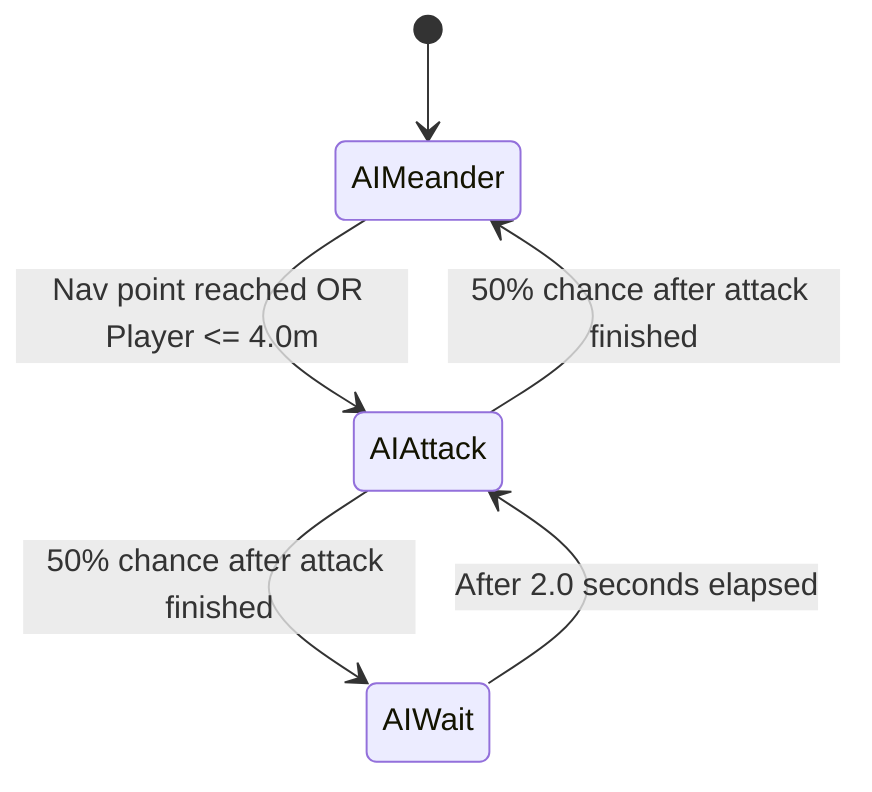

# Walkthrough - Issue #2: Unified Character, Dual State Machines, Attack Timing & Defeat Lock

Issue #2 has been completed and verified. `Player` and `Enemy` are unified into a single [`Character`](file:///d:/docs/godot/godot-roguelite-starting-project/Character/character.gd) class, input and AI are decoupled into components, original attack timing is restored, and post-death movement/rotation has been completely locked.

---

## 1. Attack Timing Restoration (Ranged Enemy)

Comparing against the pre-refactor implementation (`git show HEAD:Enemy/ranged_enemy.tscn` and `git show HEAD:StateMachine/EnemyStates/`):

| Aspect | Pre-Refactor Behavior | Issue in First Refactor | Restored Architecture |
|---|---|---|---|
| **AI Navigation** | Wandered between random nav points (`EnemyMeander`). Never chased player. | Chased player directly via `AIPursue` with 6.0m range. | Restored pure wander via [`AIMeander`](file:///d:/docs/godot/godot-roguelite-starting-project/StateMachine/AIStates/ai_meander.gd). |
| **Attack Trigger Range** | `attack_range = 4.0m` (or destination reached). | `attack_range = 6.0m` (and 8.0m detection). | Restored `attack_range = 4.0m`. |
| **Attack Delay / Cooldown** | 50% transitioned to `EnemyWait` (**2.0 seconds**), 50% to `EnemyMeander` (walked to new point). | Attacked continuously on every frame once body returned to `EnemyMove` (0.016s delay). | Restored [`AIAttack`](file:///d:/docs/godot/godot-roguelite-starting-project/StateMachine/AIStates/ai_attack.gd) transitioning 50/50 to [`AIWait`](file:///d:/docs/godot/godot-roguelite-starting-project/StateMachine/AIStates/ai_wait.gd) (2.0s wait) or [`AIMeander`](file:///d:/docs/godot/godot-roguelite-starting-project/StateMachine/AIStates/ai_meander.gd). |
| **Shooting Cadence** | ~3 to 6 seconds between shots. | ~0.8 seconds (machine gun spam). | Restored ~3 to 6 seconds between shots. |

---

## 2. Restored Mind & Body State Machine Loop



### AI Mind States (`AIStateMachine`):
1. **[`AIMeander`](file:///d:/docs/godot/godot-roguelite-starting-project/StateMachine/AIStates/ai_meander.gd)**:
   - Picks a random point on the navigation mesh.
   - Moves the body towards that point.
   - If destination reached OR player is within `attack_range = 4.0m`:
     - Transitions to `AIAttack`.
2. **[`AIAttack`](file:///d:/docs/godot/godot-roguelite-starting-project/StateMachine/AIStates/ai_attack.gd)**:
   - Commands body to stop and faces target.
   - Orders body: `ai_state_machine.order_attack("EnemyAttack")`.
   - Waits for body attack to complete.
   - Once complete, randomly selects 50/50 from `next_states: [AIWait, AIMeander]`.
3. **[`AIWait`](file:///d:/docs/godot/godot-roguelite-starting-project/StateMachine/AIStates/ai_wait.gd)**:
   - Commands body to stop (body idles in `EnemyMove`).
   - Waits for `wait_duration = 2.0` seconds.
   - On timeout, faces player and transitions back to `AIAttack`.

---

## 3. Defeat Inactivity & Corpse Rotation Lock

### Root Cause of Post-Death Movement
Before the refactor, a single state machine transitioned to `EnemyDefeat`, stopping `EnemyPursue`. With dual state machines, `AIStateMachine` kept running its active state (`AIPursue` or `AIMeander`), which continually called `character.look_at_target()` and `command_move()` on the corpse.

### Implemented Fixes
1. **[`Character.is_alive()`](file:///d:/docs/godot/godot-roguelite-starting-project/Character/character.gd)**:
   - Returns `health_component.current_health > 0.0`.
2. **Rotation Lock on Corpses**:
   - `look_at_target()` and `look_toward_direction()` in `Character` strictly return early if `not is_alive()`. Even if commanded, corpses cannot rotate.
3. **AI Deactivation on Defeat**:
   - In `_on_health_component_defeat()` and [`EnemyDefeat.enter()`](file:///d:/docs/godot/godot-roguelite-starting-project/StateMachine/EnemyStates/enemy_defeat.gd):
     - `ai_state_machine.command_stop()`
     - `ai_state_machine.set_physics_process(false)`
     - `ai_state_machine.set_process_unhandled_input(false)`
     - Intents (`move_direction`, `face_direction`, `aim_direction`, `velocity`) are zeroed out.
4. **AI State Machine Guards**:
   - `AIStateMachine._physics_process()`, `command_move()`, and `order_attack()` early-return if `not character.is_alive()`.
   - All individual AI states (`AIPursue`, `AIMeander`, `AIWait`, `AIAttack`) early-return in `physics_update()` if `not character.is_alive()`.

---

## 4. Verification & Validation Results

### Full Automated Test Suite Execution
```bash
python run_tests.py
```
```
=== Running 13 test suites (timeout: 20s/test) ===

>>> [1/13] Running test_attack_aiming.tscn... [OK] (1.46s)
>>> [2/13] Running test_attack_cycle.tscn... [OK] (3.32s)
>>> [3/13] Running test_attack_dummy.tscn... [OK] (0.54s)
>>> [4/13] Running test_audio.tscn... [OK] (0.26s)
>>> [5/13] Running test_character_and_ai.tscn... [OK] (0.44s)
>>> [6/13] Running test_combo_and_dash_cancel.tscn... [OK] (8.88s)
>>> [7/13] Running test_damage_flash_and_shake.tscn... [OK] (1.28s)
>>> [8/13] Running test_enemy_base.tscn... [OK] (0.91s)
>>> [9/13] Running test_health_bar.tscn... [OK] (1.18s)
>>> [10/13] Running test_queued_attack.tscn... [OK] (1.83s)
>>> [11/13] Running test_shake_camera.tscn... [OK] (0.72s)
>>> [12/13] Running test_voxel_gi.tscn... [OK] (0.44s)
>>> [13/13] Running test_world_boundary.tscn... [OK] (0.82s)

============================================================
ALL 13 TESTS PASSED! (22.09s total)
============================================================
```

### Dedicated Defeat Test in [`test/test_character_and_ai.tscn`](file:///d:/docs/godot/godot-roguelite-starting-project/test/test_character_and_ai.tscn)
- **Part 8**: Confirms `is_alive()` returns false on defeat, verifies `AIStateMachine` physics processing is disabled, verifies intent vectors are zeroed, verifies `look_at_target()` and `look_toward_direction()` leave corpse rotation completely unchanged, and confirms `command_move()` and `order_attack()` are rejected.
